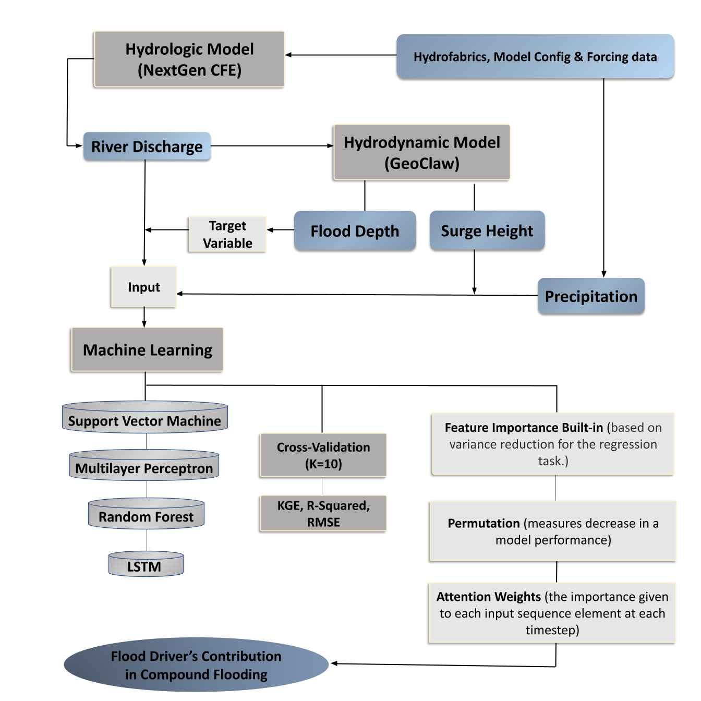
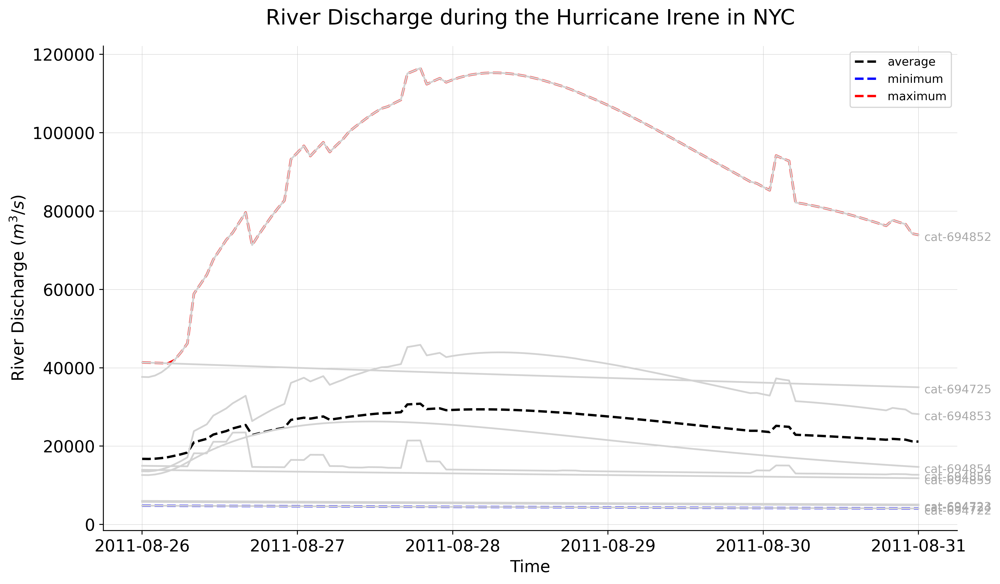
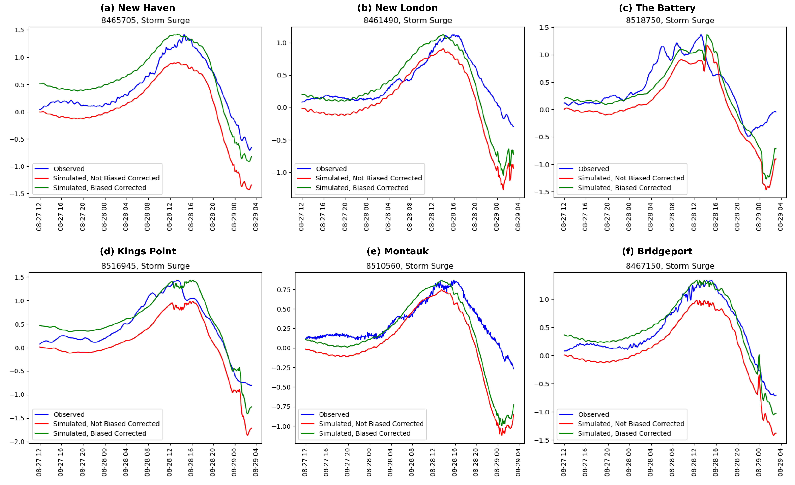

# Analysis of Flood Drivers Contributions to Compound Flooding Using Coupled Modeling and Machine Learning

**Javed Ali<sup>1</sup>, Sadaf Mahmoudi<sup>2</sup>, Farnaz Yarveysi<sup>3</sup>, Samuel Daramola<sup>4</sup>**

<sup>1</sup>University of Central Florida; _javed.ali@ucf.edu_

<sup>2</sup>University of Alabama, Tuscaloosa; _smahmoudikouhi@crimson.ua.edu_

<sup>3</sup>University of Alabama, Tuscaloosa; _fyarveysi@crimson.ua.edu_

<sup>4</sup>Virginia Tech, Blacksburg; _samueldaramola@vt.edu_

**Academic Advisors:** Thomas Wahl, _University of Central Florida<sup>1</sup>_; Hamed Moftakhari, _University of Alabama<sup>2</sup>_; Hamid Moradkhani, _University of Alabama<sup>3</sup>_; David Muñoz, _Virginia Tech<sup>4</sup>_

**Summer Institute Theme Advisor:** Kyle T. Mandli, Columbia University, _kyle.mandli@columbia.edu_

---

**Abstract:** This study aimed to understand the drivers of compound flooding in New York City (NYC) using advanced hydrological and hydrodynamic modeling techniques and machine learning methods. We employed the National Water Center's Conceptual Functional Equivalent (CFE) model for hydrologic modeling of eight delineated watersheds within the NYC area, and for hydrodynamic modeling, we used GeoClaw, incorporating river discharge data from CFE. By coupling these two modeling methodologies, we simulated nine historical storm events, determining the combined effects of precipitation, storm surge, and river discharge as drivers of compound flooding. To quantify their relative contributions, we trained and validated four machine learning models – Random Forest, Support Vector Machine, LSTM, and Multi-Layer Perceptron – on the modeled flood depth data. Our findings demonstrated the distinct relative contributions of each flood driver, offering new insights into the dynamics of compound flooding in NYC. These results, supported by historical data, have profound implications for urban planning, disaster management, and policy-making in NYC, providing a solid foundation for developing targeted strategies to mitigate compound flooding.

---

## 1. Motivation

Compound flooding, a phenomenon resulting from the interaction of multiple drivers, such as heavy rainfall, storm surge, and river discharge, poses significant risks to coastal communities in the United States [1]. The severity and frequency of these events are expected to increase due to climate change, necessitating a comprehensive understanding of the contributing drivers and their interactions [2]. Historically, the study of flooding events has often been compartmentalized, with separate analyses conducted for different types of flooding such as fluvial, pluvial, and coastal contributions. However, in many instances, these events do not occur in isolation but rather in combination, leading to compound flooding. The drivers of these events, including storm characteristics, sea-level rise, and land-use changes, can interact in complex ways to exacerbate flooding impacts. In New York City (NYC), for instance, the observed rise in compound events has been attributed to a shift toward weather patterns characterized by storm surges that coincide with increased precipitation, contributing to the intensifying occurrence of extreme weather events in the region [3]. Traditional modeling approaches have struggled to accurately capture these interactions due to their inherent complexity and the high dimensionality of the problem. However, recent advances in computational power and the development of sophisticated coupled models that integrate atmospheric, oceanic, and hydrological processes have opened new possibilities for studying compound flooding [4]. Despite these advances, significant challenges remain in analyzing compound flooding events. Machine learning, with its ability to handle high-dimensional data and capture complex patterns [5], offers a promising tool for improving our understanding and analysis of compound flooding. The main objective of this study is to understand and quantify the relative contributions of various flood drivers to compound flooding in NYC. The use of hydrologic and hydrodynamic coupled modeling, along with different machine learning methods, provides a robust framework for analyzing these drivers and their contributions to compound flooding in different parts of NYC under various storm and flooding scenarios. This research is not only crucial for advancing our scientific understanding of these extreme events but also has significant implications for flood risk management and climate change adaptation strategies.

## 2. Objectives and Scope

This study aims to assess the relative contributions of various flood drivers that may have contributed to compound flooding in Manhattan, New York City, during various historical storms. To achieve this objective, a coupled model that integrates both hydrological and hydrodynamic processes is implemented. The hydrological component of the model utilizes the National Water Center’s CFE (Conceptual Functional Equivalent) model within the NextGen Framework, while the hydrodynamic component employs the GeoClaw numerical model. By coupling these models, the study simulates the impact of hurricanes and tropical storms that have affected New York City in recent years. The outputs of the coupled model provide insights into the flood drivers associated with each simulated event. Additionally, the hydrodynamic modeling component allows for the estimation of flood depths across the study area. To further investigate the contribution of each flood driver to the flood depth at the tract-level resolution, machine learning algorithms were employed. By leveraging various machine learning algorithms, the study aims to determine the relative importance and contribution of each flood driver in different parts of Manhattan. This integrated approach combining coupled modeling, hydrodynamic simulations, and machine learning techniques will provide valuable insights into the relative contributions of flood drivers in Manhattan, ultimately enhancing our understanding of flood processes and facilitating effective flood management and mitigation strategies in urban coastal areas.

## 3. Previous Studies

GeoClaw is a two-dimensional hydrodynamic model that incorporates adaptive mesh refinement capabilities, primarily designed for simulating shallow earth-surface flows involving water-wave propagation and inundation, including scenarios such as tsunamis, storm surges, and general overland flooding [6]. High-resolution finite volume methods are employed in GeoClaw to address geophysical flow problems. Spero et al. [7] compared GeoClaw with HEC-RAS for modeling the 1976 Teton Dam failure. The evaluation of GeoClaw's suitability for dam failure modeling was based on its ability to accurately depict the extent of inundation and the arrival times of flood waves. The study found that the 2D GeoClaw dam-break model produced results that reasonably aligned with historical gauge records, field observational data, and HEC-RAS results. The model demonstrated stability and relatively low computational costs. While GeoClaw has been predominantly utilized in dam failure, tsunami, and geo-hazard studies, there are limited examples of its application in flood modeling. The use of GeoClaw in coastal flooding and storm surge simulations is not extensively documented. Hence, in this study, we propose to employ GeoClaw and validate its performance against observational data from NOAA tide gauges to assess its efficacy in simulating coastal flooding events. The selection of the most significant features plays a crucial role in pattern recognition systems. Nowadays, when examining the combined effects of multiple variables, researchers often employ machine learning techniques to obtain relevance scores [8]. For instance, Yarveysi et al. [1] used a machine learning algorithm to objectively assign weights to variables contributing to the overall estimated vulnerability, thus reducing subjectivity in determining the impact of various social, economic, and infrastructural factors on vulnerability. Similarly, Opoku et al. [9] utilized five supervised machine learning algorithms to predict depression. Through the permutation importance method, they were able to identify influential behavioral markers in the prediction of depression.

## 4. Methodology

### 4.1 Data and Study Area

This study focuses on analyzing historic storms that occurred between 2007 and 2019 and impacted New York City (NYC) (Figure 1a). We selected eight catchments that cover the whole study area (Figure 1b). The selected time period aligns with the capabilities of the hydrofabric AORC (Atmospheric Oceanic Reanalysis and Characterization) data utilized in this study.


**Figure 1:** (a) Study area: Manhattan, New York City, and (b) eight catchments used in the study area.

Table 1 presents the information about the storms, and their ATCF (Automated Tropical Cyclone Forecasting) names. All 9 storms included in the analysis are simulated using the CFE model, and the maximum discharge associated with each storm is subsequently used as an input parameter for the GeoClaw hydrodynamic model. The storm data utilized in GeoClaw, including the storm's eye latitude, longitude, pressure, wind speed, and radius, can be obtained from the following repository: [https://ftp.nhc.noaa.gov/atcf/archive/](https://ftp.nhc.noaa.gov/atcf/archive/). By incorporating the storm data from these selected events, this study aims to comprehensively examine the hydrological and hydrodynamic processes associated with historic storms in NYC, providing valuable insights into flood dynamics and contributing to enhanced flood risk management strategies.

**Table 1:** Information about the storm events, their respective landfall dates, the dates of impact on NYC, the hour of landfall, and their ATCF names

<table>
  <tr>
   <td>Storms
   </td>
   <td>Date of Landfall
   </td>
   <td>Date of impact in NYC
   </td>
   <td>Hour of landfall
   </td>
   <td>ATCF data 
   </td>
  </tr>
  <tr>
   <td>Tropical Storm Barry
   </td>
   <td>2-Jun-2007
   </td>
   <td>5-Jun-2007
   </td>
   <td>02:00
   </td>
   <td>AL022007
   </td>
  </tr>
  <tr>
   <td>Hurricane Hannah
   </td>
   <td>6-Sep-2008
   </td>
   <td>6-Sep-2008
   </td>
   <td>07:20
   </td>
   <td>AL082008
   </td>
  </tr>
  <tr>
   <td>Hurricane Irene 
   </td>
   <td>28-Aug-2011
   </td>
   <td>28-Aug-2011
   </td>
   <td>13:00
   </td>
   <td>AL092011
   </td>
  </tr>
  <tr>
   <td>Hurricane Sandy
   </td>
   <td>29-Oct-2012
   </td>
   <td>29-Oct-2012
   </td>
   <td>23:30
   </td>
   <td>AL182012
   </td>
  </tr>
  <tr>
   <td>Hurricane Arthur 
   </td>
   <td>4-Jul-2014
   </td>
   <td> 4-Jul-2014
   </td>
   <td>08:00
   </td>
   <td>AL012014
   </td>
  </tr>
  <tr>
   <td>Tropical Storm Jose
   </td>
   <td>19-Sep-2017
   </td>
   <td>20-Sep-2017
   </td>
   <td>00:00
   </td>
   <td>AL122017
   </td>
  </tr>
  <tr>
   <td>Tropical Storm Philippe
   </td>
   <td>28-Oct-2017
   </td>
   <td>30-Oct-2017
   </td>
   <td>22:00
   </td>
   <td>AL182017
   </td>
  </tr>
  <tr>
   <td>Hurricane Dorian 
   </td>
   <td>6-Sep-2019
   </td>
   <td>7-Sep-2019
   </td>
   <td>12:30
   </td>
   <td>AL052019
   </td>
  </tr>
  <tr>
   <td>Hurricane Ogla
   </td>
   <td>27-Oct-2019
   </td>
   <td>27-Oct-2019
   </td>
   <td>03:00
   </td>
   <td>AL172019
   </td>
  </tr>
</table>

#### 4.2 Hydrologic Modeling using the National Water Center’s CFE Model

The National Water Center’s Conceptual Functional Equivalent (CFE) model is a conceptual rainfall-runoff model, which is designed to represent complex hydrological processes using simplified, easy-to-understand concepts. The model is designed to simulate how rainfall gets converted into runoff, a key process in understanding how much water will flow into rivers and streams after a rain event. It's designed with an implementation of the Basic Model Interface (BMI), a standard set of functions and procedures designed to facilitate model coupling in integrated environmental modeling studies.

**4.2.1 Generation of HydroFabric Subsets**

The first stage of hydrologic modeling with CFE involves the acquisition and processing of HydroFabric data specific to the eight delineated watersheds within the study area. The hydrological data were retrieved from the Amazon S3 Bucket (https://nextgen-hydrofabric.s3.amazonaws.com). Subsequent to retrieval, the necessary information was extracted and processed for the construction of parameter configuration files.

**4.2.2 Parameter Configuration for Hydrological Modeling**

The parameter configuration files play an important role in facilitating the operation of the Conceptual Functional Equivalent (CFE) model and the Simple Logical Tautology Handler (SLoTH) within the context of the NextGen framework. These files comprise a variety of components, including model default parameters, specific formulations, detailed input and output paths, simulation time steps, and initial conditions. Furthermore, they encapsulate additional settings that are pertinent to the accurate modeling of the hydrological system under study.

**4.2.3 Preparation of Basin-Averaged Forcing Inputs**

The next step in this process is the generation of basin-averaged forcing inputs, each tailored to match distinct storm event time periods within the eight individual watersheds of the study area. The input data, extracted from AORC v1.0 kerchunk header files, is prepared specifically for integration with NOAA's advanced Next Generation (NextGen) Water Resource Modeling Framework.

**4.2.4 Execution of the CFE Model within the NGEN Framework**

For running the CFE model within the NGEN framework using BMI, we used the following command:

```bash
> ngen config/catchments.geojson "" config/nexus.geojson "" config/realization.json ""
```

This command combines the positional arguments for the execution of the CFE model within the NextGen framework.

#### 4.3 Hydrodynamic Modeling using GeoClaw

**4.3.1 Setting up the model for validation**

The model was set up according to the descriptive specifications in the [clawpack repository](https://www.clawpack.org/geoclaw_started.html) and [our model repository](https://github.com/javedali99/si2023-compound-flooding/blob/main/README.md) on GitHub.

**4.3.2 Incorporating river discharge**

The subroutine “src2” script, written in Fortran, was used to integrate the river discharge into the model. It sets certain geographical bounds for the river source and computes the river's discharge in cubic meters per second for cells that fall within the river source area.

**4.3.3 Bias Correction**

A maximum bias correction is a statistical approach employed in hydrological and meteorological modeling to address systematic biases in modeled variables. The methodology of maximum bias correction [10] involves identifying the maximum bias between the modeled and observed data, followed by the application of a correction factor to mitigate or eliminate the bias. The primary objective of maximum bias correction is to enhance the accuracy and reliability of modeled outputs.



**Figure 2:** Flowchart showing the methodology employed in this study.

### 4.4 Machine Learning Approach

To assess the relative influence of flood drivers on compound flooding, machine learning (ML) algorithms were utilized to weigh each driver's contribution to the overall flood depth, using data from the coupled modeling of nine historical storms. Inputs to the ML models included precipitation, storm surge, and river discharge data. These models were trained and validated using flood depth from the GeoClaw hydrodynamic model. The effectiveness of four ML algorithms - Random Forest (RF), Support Vector Machine Regression (SVMR), Long Short Term Memory (LSTM), and Multi-Layer Perceptron (MLP) - were compared using different evaluation metrics. RF's inherent feature importance mechanism was used for the regression task, while the permutation importance method was utilized for SVMR, LSTM, and MLP to calculate feature importance. K-fold cross-validation (K=10) was employed to verify the algorithm's performance on new data, ensuring stability in accuracy estimates.

**4.5 Evaluation Metrics**

Four evaluation metrics were used to assess the effectiveness of the machine learning and the hydrodynamic models.: the Nash-Sutcliffe efficiency (NSE) [11], gauging the predictive accuracy and reliability of the model; the Kling-Gupta efficiency (KGE) [12], providing an overall assessment of the model's ability to replicate observed values in terms of timing, magnitude, and variability; the coefficient of determination (R-squared), representing the proportion of variance in the dependent variable that can be attributed to the independent variables; and the root mean square error (RMSE), which assessed the accuracy and precision of the model by measuring the average discrepancy between predicted and observed values [13].

## 5. Results

### 5.1 Hydrologic Modeling with NextGen CFE Model

Figure 3 shows the river discharge for different catchments over time during Hurricane Irene (2011). The river discharge for each catchment generally increases over time, which is expected as the hurricane progresses. There is a notable peak in discharge rates for all catchments around August 28, which likely corresponds to the height of the hurricane. Catchment "cat-694852” consistently has the highest discharge rate throughout the event, reaching close to 120,000 cubic meters per second at its peak. Catchments "cat-694853" and "cat-694854" also show significant increases in discharge during the hurricane, with maximum values around 46,000 and 26,000 cubic meters per second, respectively. The rest of the catchments have lower overall discharge rates, with maximum values not exceeding 24,000 cubic meters per second. The high values of discharge could be attributed to the intense rainfall and strong winds associated with Hurricane Irene. These conditions can result in a significant increase in river discharge, as more water is transported into rivers and streams from direct rainfall and surface runoff. Results for other storm events are shown in the supplementary information.



**Figure 3:** River discharge output from the NextGen CFE model during Hurricane Irene (2011) for different catchments in the NYC area. The red color indicates the catchment with the highest discharge, the blue color indicates the catchment with the lowest discharge, and the black color indicates the average discharge during Hurricane Irene.

### **5.2 Hydrodynamic Modeling using GeoClaw Model**

In this study, the model's performance was validated in the context of two hurricanes, Irene (2011) and Sandy (2012). The results of Sandy is shown in the Supplementary Information. The performance of the GeoClaw model in capturing storm events exhibits notable proficiency in capturing the peak of storms. However, during the initial days leading up to the storm event, the model may exhibit variations. Consequently, to ensure a reliable validation process, the decision was made to focus solely on validating the model against the peak of the storms. Figure 4 shows the comparison between the simulation and observation time series at the time of the storm’s peak during Hurricane Irene, which provides evidence of GeoClaw's proficiency in capturing the peak of the storm. Moreover, evaluation metrics of the biased corrected and not biased corrected simulation results of Hurricane Irene are shown in Table 2. These findings highlight the station-specific effects of bias correction on the evaluation of the models used in the study.



**Figure 4:** Comparison of observed, simulated, and maximum biased corrected simulated storm surges during Hurricane Irene (2011).

**Table 2:** The evaluation metrics of simulated storm surges during Hurricane Irene; a) without any bias correction; b) with maximum bias correction

<table>
  <tr>
   <td colspan="6" >

<li>Hurricane Irene's Evaluation Metrics, No Bias Correction
</li>

   </td>
  </tr>
  <tr>
   <td>Station Name
   </td>
   <td>Station ID
   </td>
   <td>NSE
   </td>
   <td>KGE
   </td>
   <td>RMSE
   </td>
   <td>R Squared
   </td>
  </tr>
  <tr>
   <td>The Battery
   </td>
   <td>8518750
   </td>
   <td>0.204
   </td>
   <td>0.313
   </td>
   <td>0.43
   </td>
   <td>0.204
   </td>
  </tr>
  <tr>
   <td>Kings Point
   </td>
   <td>8516945
   </td>
   <td>0.515
   </td>
   <td>0.344
   </td>
   <td>0.391
   </td>
   <td>0.515
   </td>
  </tr>
  <tr>
   <td>Montauk
   </td>
   <td>8510560
   </td>
   <td>-0.188
   </td>
   <td>0.109
   </td>
   <td>0.296
   </td>
   <td>-0.188
   </td>
  </tr>
  <tr>
   <td>Bridgeport
   </td>
   <td>8467150
   </td>
   <td>0.674
   </td>
   <td>0.428
   </td>
   <td>0.292
   </td>
   <td>0.674
   </td>
  </tr>
  <tr>
   <td>New Haven
   </td>
   <td>8465705
   </td>
   <td>0.612
   </td>
   <td>0.342
   </td>
   <td>0.309
   </td>
   <td>0.612
   </td>
  </tr>
  <tr>
   <td>New London
   </td>
   <td>8461490
   </td>
   <td>0.353
   </td>
   <td>0.324
   </td>
   <td>0.291
   </td>
   <td>0.353
   </td>
  </tr>
</table>

<br>

<table>
  <tr>
   <td colspan="6" >

<li>Hurricane Irene's Evaluation Metrics, Biased Corrected
</li>

   </td>
  </tr>
  <tr>
   <td>Station Name
   </td>
   <td>Station ID
   </td>
   <td>NSE
   </td>
   <td>KGE
   </td>
   <td>RMSE
   </td>
   <td>R Squared
   </td>
  </tr>
  <tr>
   <td>The Battery
   </td>
   <td>8518750
   </td>
   <td>0.559
   </td>
   <td>0.594
   </td>
   <td>0.32
   </td>
   <td>0.559
   </td>
  </tr>
  <tr>
   <td>Kings Point
   </td>
   <td>8516945
   </td>
   <td>0.847
   </td>
   <td>0.737
   </td>
   <td>0.219
   </td>
   <td>0.847
   </td>
  </tr>
  <tr>
   <td>Montauk
   </td>
   <td>8510560
   </td>
   <td>-0.45
   </td>
   <td>0.077
   </td>
   <td>0.327
   </td>
   <td>-0.45
   </td>
  </tr>
  <tr>
   <td>Bridgeport
   </td>
   <td>8467150
   </td>
   <td>0.917
   </td>
   <td>0.835
   </td>
   <td>0.146
   </td>
   <td>0.917
   </td>
  </tr>
  <tr>
   <td>New Haven
   </td>
   <td>8465705
   </td>
   <td>0.685
   </td>
   <td>0.568
   </td>
   <td>0.278
   </td>
   <td>0.685
   </td>
  </tr>
  <tr>
   <td>New London
   </td>
   <td>8461490
   </td>
   <td>0.299
   </td>
   <td>0.478
   </td>
   <td>0.303
   </td>
   <td>0.299
   </td>
  </tr>
</table>

### 5.3 Machine Learning

<br>

## 6. Conclusion

<br>

**Supplementary Material:** The supplementary information can be found here: [https://docs.google.com/document/d/1OemFHBR5sbqGaAsLKTmkgxRfF-ajq4OV7VDUpifgD0c/edit](https://docs.google.com/document/d/1OemFHBR5sbqGaAsLKTmkgxRfF-ajq4OV7VDUpifgD0c/edit). The computational code utilized for hydrologic and hydrodynamic modeling, alongside the machine learning algorithms implemented in this study, are accessible at our open-access GitHub repository [https://github.com/javedali99/si2023-compound-flooding](https://github.com/javedali99/si2023-compound-flooding)

<br>
## References

1. Yarveisi, F., Alipour,A., Moftakhari, H., Jafarzadegan, K., Moradkhani, H.(2023). Block-Level Vulnerability Assessment Reveals Disproportionate Impacts of Natural Hazards across the Conterminous United States. Nature Communications. DOI: 10.1038/s41467-023-39853-z.
2. Ming, X., Liang, Q., Dawson, R., Xia, X., & Hou, J. (2022). A quantitative multi-hazard risk assessment framework for compound flooding considering hazard inter-dependencies and interactions. _Journal of Hydrology_, _607_, 127477.[ https://doi.org/10.1016/j.jhydrol.2022.127477](https://doi.org/10.1016/j.jhydrol.2022.127477).
3. Lacy, H. S., DeVito, A., & De Nivo, A. C. (2013). Geotechnical Aspects of Three Storm Surge Barrier Sites to Protect New York City from Flooding. In Storm Surge Barriers to Protect New York City: Against The Deluge (pp. 134-149). [https://doi.org/10.1061/9780784412527.010](https://doi.org/10.1061/9780784412527.010).
4. Olbert, A. I., Moradian, S., Nash, S., Comer, J., Kazmierczak, B., Falconer, R. A., & Hartnett, M. (2023). Combined statistical and hydrodynamic modelling of compound flooding in coastal areas—Methodology and application. _Journal of Hydrology_, _620_, 129383.[ https://doi.org/10.1016/j.jhydrol.2023.129383](https://doi.org/10.1016/j.jhydrol.2023.129383)
5. Dargan, S., Kumar, M., Ayyagari, M. R., & Kumar, G. (2020). A Survey of Deep Learning and Its Applications: A New Paradigm to Machine Learning. _Archives of Computational Methods in Engineering_, _27_(4), 1071–1092.[ https://doi.org/10.1007/s11831-019-09344-w](https://doi.org/10.1007/s11831-019-09344-w).
6. Berger, M. J., George, D. L., LeVeque, R. J., & Mandli, K. T. (2011). The GeoClaw software for depth-averaged flows with adaptive refinement. Advances in Water Resources, 34(9), 1195–1206.[ https://doi.org/10.1016/j.advwatres.2011.02.016](https://doi.org/10.1016/j.advwatres.2011.02.016).
7. Spero, H., Calhoun, D., & Schubert, M. (2022). Simulating the 1976 Teton Dam Failure using Geoclaw and HEC-RAS and comparing with Historical Observations (arXiv:2206.00766). arXiv.[ http://arxiv.org/abs/2206.00766](http://arxiv.org/abs/2206.00766).
8. J. M. Fontana, M. Farooq and E. Sazonov, "Estimation of feature importance for food intake detection based on Random Forests classification," 2013 35th Annual International Conference of the IEEE Engineering in Medicine and Biology Society (EMBC), Osaka, Japan, 2013, pp. 6756-6759, doi: 10.1109/EMBC.2013.6611107.
9. Opoku Asare K, Terhorst Y, Vega J, Peltonen E, Lagerspetz E, Ferreira D. Predicting Depression From Smartphone Behavioral Markers Using Machine Learning Methods, Hyperparameter Optimization, and Feature Importance Analysis: Exploratory Study. JMIR Mhealth Uhealth 2021;9(7):e26540.
10. Teklu T. Hailegeorgis and Knut Alfredsen, "Regional flood frequency analysis and prediction in ungauged basins including estimation of major uncertainties for mid-Norway", Journal of Hydrology: Regional Studies, vol. 9, pp. 104-126, 2017.
11. Nash, J.E. and Sutcliffe, J.V. (1970) River Flow Forecasting through Conceptual Model. Part 1—A Discussion of Principles. Journal of Hydrology, 10, 282-290.
12. Gupta, H. V., & Kling, H. (2009). On the evaluation of hydrological models: towards a measurable paradigm. Hydrology and Earth System Sciences, 13(12), 1869-1880.
13. Chai, T., & Draxler, R. R. (2014). Root mean square error (RMSE) or mean absolute error (MAE)? – Arguments against avoiding RMSE in the literature. Geoscientific Model Development, 7(3), 1247–1250. https://doi.org/10.5194/gmd-7-1247-2014.
